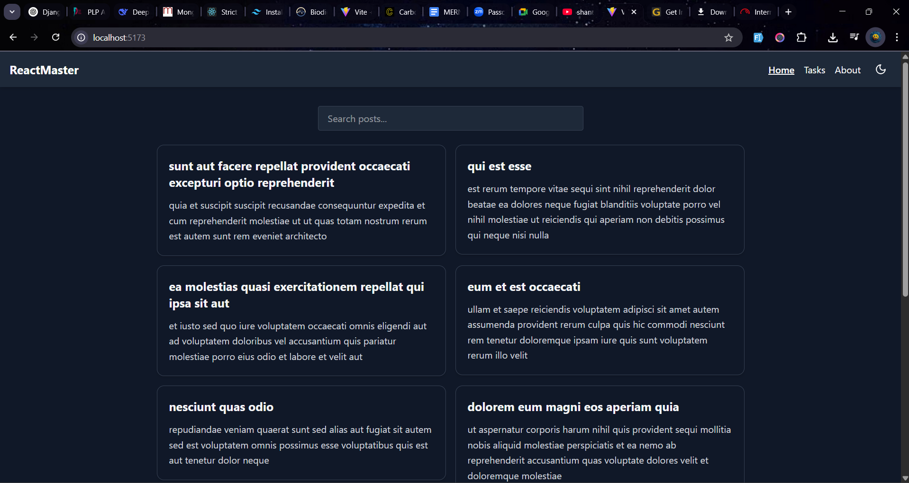

# 🎨 Week 3: React.js, JSX, and Tailwind CSS – Mastering Front-End Development

## 🚀 Objective
Build a responsive React application demonstrating component architecture, state management with hooks, theme toggling, and API integration.

---

## 📸 Demo

🔗 **Live Site:** [Add your deployed site link here]

---

## 🧠 Features Overview

- ⚛️ Built with React + Vite
- 🎨 Styled using Tailwind CSS with full dark mode support
- 🌗 Theme toggle (Light/Dark mode) via React Context
- ✅ Task Manager:
  - Add, complete, delete & filter tasks
  - Tasks persist via localStorage (custom `useLocalStorage` hook)
- 🌐 API Integration:
  - Fetched blog posts from JSONPlaceholder
  - Searchable and paginated
- ♻️ Component-based architecture with reusable UI elements

---

## 📂 Project Structure

```
src/
├── components/
│   ├── Card.jsx
│   ├── Navbar.jsx
│   ├── Footer.jsx
│   ├── ThemeToggle.jsx
├── context/
│   ├── ThemeContext.jsx
│   └── useTheme.js
├── hooks/
│   ├── useFetch.js
│   └── useLocalStorage.js
├── pages/
│   ├── Home.jsx
│   ├── About.jsx
│   ├── TaskManager.jsx
│   └── Details.jsx
├── App.jsx
├── main.jsx
└── index.css
```

---

## 🧪 Assignment Tasks Checklist

### ✅ Task 1: Project Setup
- [x] Vite + React + Tailwind
- [x] React Router DOM
- [x] Clean project structure

### ✅ Task 2: Component Architecture
- [x] Navbar & Footer
- [x] Reusable Card component
- [x] Layout wrapper for shared structure
- [x] ThemeToggle button

### ✅ Task 3: State Management & Hooks
- [x] TaskManager with task operations
- [x] `useState`, `useEffect`, `useContext`, `useLocalStorage`

### ✅ Task 4: API Integration
- [x] Fetch posts from JSONPlaceholder
- [x] Pagination, search, error/loading states

### ✅ Task 5: Tailwind Styling
- [x] Fully responsive layout
- [x] Light/dark mode toggle
- [x] Transitions and hover effects

---

## 🛠️ Setup Instructions

1. **Clone the repo**  
   ```bash
   git clone https://github.com/PLP-MERN-Stack-Development/week-3-react-js-assignment-Lervez5.git
   cd your-repo
   ```

2. **Install dependencies**  
   ```bash
   pnpm install
   ```

3. **Run locally**  
   ```bash
   pnpm run dev
   ```

---

## 🖼️ Screenshots

| dark Mode | light Mode |
|------------|-----------|
|  |

---

## 🔗 Deployment

✅ Deployed with [/Netlify/]  
🔗 **URL:** _Add your live link here_

---

## 👨‍💻 Author

- Name: Enock Bosire
- GitHub: [@Enock Bosire](https://github.com/Lervez5)

---

> 💯 Submitted for Week 3 React Assignment — Built with React, Tailwind, and 💙